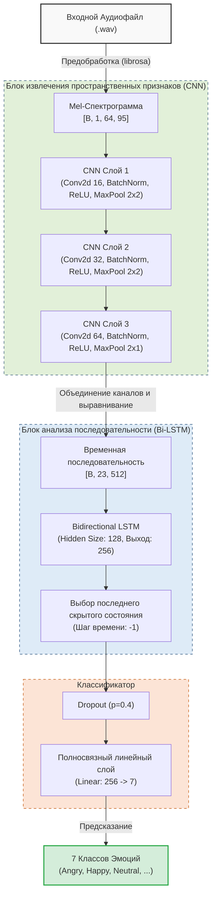

# Архитектура Нейронной Сети: Распознавание Эмоций (CNN + BiLSTM)

Настоящий документ содержит исчерпывающее техническое описание модели машинного обучения, разработанной для классификации звуковых дорожек по 7 эмоциональным классам. В документации послойно разбирается архитектура `EmotionModel` на базе PyTorch, а также пайплайн подготовки данных.

---

> [!NOTE]
> **Контекст задачи**
> Звук представляет собой одномерный сигнал, который сложно анализировать напрямую из-за высокой размерности (16 000 значений амплитуды в секунду). Общепринятый подход в Deep Learning — перевести звук в 2D-изображение (спектрограмму) и применять к нему алгоритмы компьютерного зрения (CNN), а затем анализировать последовательность во времени (RNN/LSTM).

## 1. Предобработка данных (Feature Engineering)

Перед тем как попасть в нейросеть, аудиофайл (в формате `.wav`) проходит строгий процесс трансформации:

1. **Загрузка сигнала (`librosa.load`)**:
   Осуществляется чтение аудиофайла с приведением к единой частоте дискретизации (`sample_rate = 16000 Гц`) и конвертацией в моноканал.
2. **Извлечение Мел-Спектрограммы (`melspectrogram`)**:
   Инструмент преобразует временную волну в матрицу частот. Ось Y разбивается на `n_mels = 64` частотных интервалов (bins), распределенных по нелинейной Мел-шкале. Мел-шкала имитирует то, как человеческое ухо воспринимает звук: мы лучше различаем низкие частоты, чем высокие.
3. **Логарифмирование амплитуды (`power_to_db`)**:
   Значения спектрограммы переводятся в децибелы (логарифмическая шкала). Это сужает диапазон значений и выделяет тихие фонемы.
4. **Нормализация по времени (Padding/Truncation)**:
   Скрипт проверяет ширину спектрограммы (ось времени X). Модель ожидает ровно `max_len = 95` кадров (что примерно равно 3 секундам аудио). Если аудио короче, матрица дополняется нулями (padding). Если длиннее — обрезается.
5. **Z-score нормализация**:
   Матрица нормализуется по формуле `(X - Mean) / Std`. Это убирает влияние общей громкости записи и делает данные удобоваримыми для нейросети (среднее значение становится равно 0, отклонение — 1).

В результате формируется тензор размерности `[64, 95]` (Высота x Ширина), который отправляется в нейросеть.

---

## 2. Послойный разбор нейросети (EmotionModel)

Модель построена по гибридной архитектуре **CNN + BiLSTM**. На вход подается батч (пакет) спектрограмм. Изначальная размерность: `(B, 64, 95)`, где `B` — размер батча (16).

В методе `forward` мы первым делом добавляем «канал» цвета: `x = x.unsqueeze(1)`. Теперь размерность равна `(B, 1, 64, 95)`. Спектрограмма воспринимается как одноканальное черно-белое изображение.

### Визуальная диаграмма архитектуры (Pipeline)

### 2.1. Извлечение пространственных признаков (CNN Блок)

Задача сверточных слоев — найти локальные паттерны в спектрограмме: резкие изменения тембра, характерные «пятна» шума, форманты гласных звуков.

#### Слой 1: Низкоуровневые признаки
- **`Conv2d(1, 16, kernel_size=3, padding=1)`**: Фильтр размером 3x3 пикселя скользит по картинке и ищет базовые линии и границы. Количество каналов (карт признаков) увеличивается до 16.
- **`BatchNorm2d(16)`**: Пакетная нормализация стабилизирует обучение, центрируя выходы свертки по батчу. Сеть учится быстрее.
- **`ReLU()`**: Нелинейность. Обнуляет все отрицательные значения, передавая дальше только те сигналы, на которые "среагировал" фильтр.
- **`MaxPool2d(2, 2)`**: Пиксельная «лупа» наоборот. Сжимает высоту и ширину картинки ровно в 2 раза, оставляя только самые яркие (максимальные) признаки в окошке 2x2. Размерность после слоя: `(B, 16, 32, 47)`.

#### Слой 2: Среднеуровневые признаки
- **`Conv2d(16, 32, kernel_size=3, padding=1)`**, **`BatchNorm`**, **`ReLU`**.
- Здесь фильтры ищут более сложные комбинации из линий первого слоя (например, составные части звуков). Каналов становится 32.
- **`MaxPool2d(2, 2)`**: Снова сжимаем высоту и ширину в два раза. Размерность становится `(B, 32, 16, 23)`. Окно обзора сети расширяется.

#### Слой 3: Высокоуровневые признаки
- **`Conv2d(32, 64, kernel_size=3, padding=1)`**, **`BatchNorm`**, **`ReLU`**.
- Сеть выделяет абстрактные характеристики тембра и интонации. Каналов: 64.
- **`MaxPool2d((2, 1))`**: 
  > [!TIP]
  > **Важный архитектурный трюк:** Обратите внимание на аргумент `(2, 1)`. Этот слой сжимает ось частот (Y) в 2 раза, но **вообще не трогает** ось времени (X). Нам необходимо сохранить временную развертку (разрешение по времени), чтобы LSTM-блоку было от чего отталкиваться.
- Размерность после всего CNN-блока: `(B, 64, 8, 23)`.

### 2.2 Мост между CNN и LSTM (Transition)

Тензор `(B, 64, 8, 23)` означает: Батч, 64 фильтра, 8 пикселей высоты (частоты), 23 шага времени.
Код `x.permute(0, 3, 1, 2).reshape(B, T, C * F)` выполняет магию: он "сплющивает" каналы и частоты в единый вектор для каждого момента времени.
Получается размерность: `(B, 23, 64 * 8)` = `(B, 23, 512)`.
Теперь для нейросети наши данные — это временной ряд длины 23, где каждый "тик" описывается вектором из 512 абстрактных признаков.

### 2.3 Анализ последовательности (BiLSTM Блок)

Эмоция никогда не кроется в одном миллисекундном фрагменте, важна динамика и развитие звука.

- **`nn.LSTM(input_size=512, hidden_size=128, bidirectional=True)`**:
  Долгая краткосрочная память (LSTM) — это вид рекуррентной сети, имеющий механизмы "ворот" (Gates), которые решают, какую информацию из прошлого забыть, а какую оставить. 
- **Bidirectional (двунаправленность)**: Сеть читает звук не только от начала к концу, но и одновременно от конца к началу. Это позволяет ей понимать контекст звука: например, смех в конце фразы может менять смысл того, что происходило в начале.
- Из-за `bidirectional=True`, размер скрытого состояния (128) умножается на 2. Выход каждого шага становится вектором размера `256`.

В коде `x = x[:, -1, :]` мы отрезаем всю последовательность и берем только **самый последний шаг**. Последний шаг унаследовал смысл (контекст) всей аудиозаписи целиком. На данном этапе размерность `(B, 256)`.

### 2.4 Финальное решение (Классификатор)

У нас есть плотный вектор качеств на 256 цифр, описывающий эмоцию аудиофайла целиком.

- **`nn.Dropout(0.4)`**: Техника регуляризации. На каждой итерации обучения случайно "отключает" 40% нейронов. Это заставляет сеть не полагаться на какие-то конкретные признаки-маркеры, а распределять знания по всему вектору, борясь с переобучением (overfitting).
- **`nn.Linear(256, 7)`**: Обычный полносвязный слой. Он берет вектор из 256 признаков и путем перемножения матриц превращает их в 7 чисел (логитов).
- Эти 7 чисел соответствуют нашим классам: `["Angry", "Disgusted", "Fearful", "Happy", "Neutral", "Sad", "Suprised"]`.
- Чем больше число, тем больше сеть уверена в своей правоте.

---

## 3. Процесс обучения (Training Loop)

Помимо самой архитектуры, в файле `train.py` настроен надежный механизм обучения.

1. **Функция потерь (`CrossEntropyLoss`)**: Идеально подходит для задачи многоклассовой классификации (mutli-class).
2. **Оптимизатор (`Adam`)**: Алгоритм стохастического градиентного спуска с адаптивными моментами. Скорость обучения `1e-3` обновляется эффективно для разных весов.
3. **Планировщик шага (`ReduceLROnPlateau`)**: Если валидационная точность перестает расти на протяжении 3 эпох (`patience=3`), шаг обучения уменьшается в 2 раза (`factor=0.5`). Это позволяет сети аккуратно "доползти" до минимума ошибки и не перескакивать его.
4. **Кросс-валидация (`Stratified K-Fold`)**: Датасет бьется на 5 частей. Модель обучается 5 раз на разных 80% данных и тестируется на оставшихся 20%. Гарантирует абсолютную честность оценки метрик, предотвращая ситуацию, когда датасет неудачно разделился.

---
*Документ автоматически сгенерирован ML подсистемой. Для получения графиков обучения и матрицы ошибок (после завершения обучения) обратитесь к файлам в директории `model_service/results`.*
